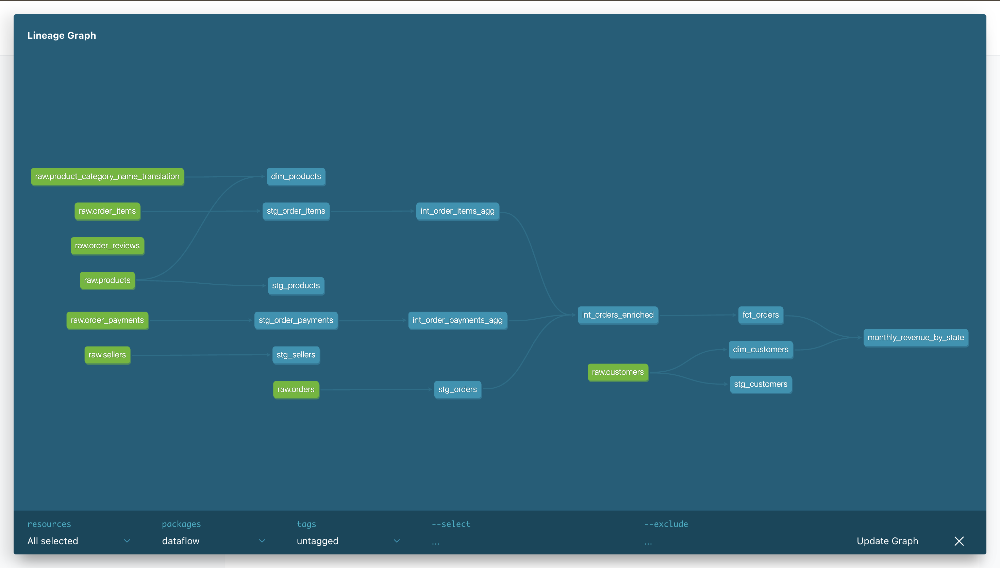
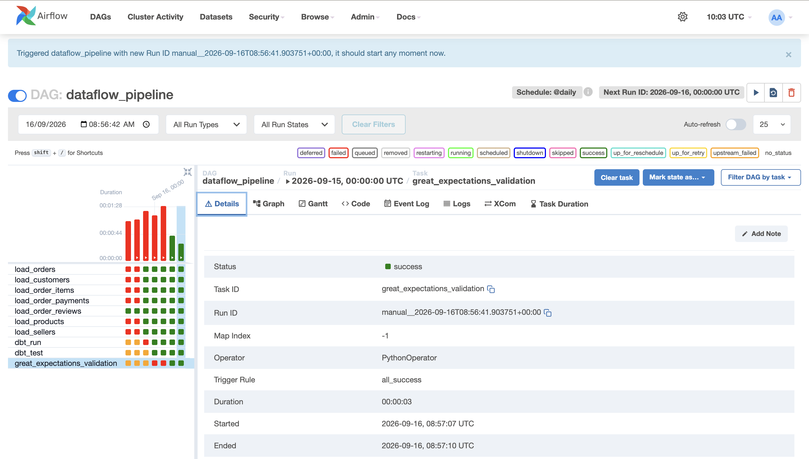

# DataFlow
An end-to-end ELT pipeline: raw e-commerce data → Airflow orchestration → dbt 
transformations (staging/intermediate/marts) → Great Expectations data quality 
gates → a portable DuckDB analytics export.

## Architecture
Raw CSVs → [Airflow: Extract/Load] → Postgres (raw schema)
                                        ↓
                            [dbt: staging → intermediate → marts]
                                        ↓
                          [Great Expectations: business-rule validation]
                                        ↓
                            [DuckDB export for portable analysis]

---

## Pipeline Visualizations & Artifacts

### 1. dbt Lineage Graph (Star Schema)
*Visualizing staging models, intermediate aggregations, and dimensional/fact marts.*


### 2. Airflow Orchestration DAG
*Green Graph view showing all 4 execution stages passing successfully in sequence.*


---

## DuckDB Analytics Export
The processed models are exported into a portable DuckDB file (`dataflow_marts.duckdb`) for local analytical querying and reporting:

| Table Name | Row Count | Description |
| :--- | :--- | :--- |
| `fct_orders` | **99,441** | Grain: One row per order item with transaction metrics & foreign keys |
| `dim_customers` | **99,441** | Grain: One row per customer with demographic & regional details |
| `dim_products` | **32,951** | Grain: One row per product featuring category dimensions |

---

## Key Design Decisions
- Star schema (`fct_orders` + `dim_customers`/`dim_products`) for analyst-friendly querying
- Pre-aggregation before joins to prevent fan-out on one-to-many relationships
- Layered dbt tests (structural) + Great Expectations (business-rule) as complementary quality gates
- Sequential Airflow dependencies so no stage runs on unvalidated upstream data

## Tech Stack
Apache Airflow · dbt · PostgreSQL · Great Expectations · DuckDB · Docker · Pandas

## Running Locally
```bash
docker compose up --build
# Airflow UI: localhost:8080 (admin/admin)
# Trigger the `dataflow_pipeline` DAG
